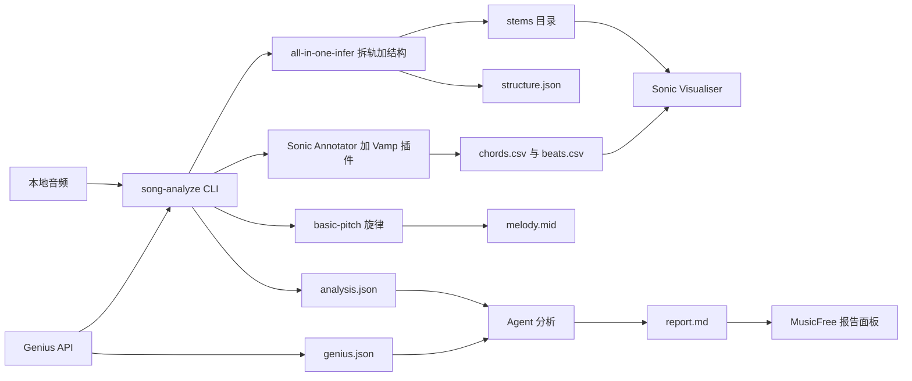

# song-analysis × MusicFree 整合计划

## 0. 一句话

给一首本地音频，自动产出「拆轨 + 结构分段 + 和弦/节拍/旋律 + Genius 资料 + Agent 讲解报告」，并在 Sonic Visualiser 中边听边看；后续把报告接入 MusicFree 播放器，与歌词高亮/AI 讲解合并。

## 1. 已确认决策

- **顺序**：先跑通 CLI（all-in-one-infer + 特征 + Genius + Sonic Visualiser），再接入 MusicFree。
- **拆轨 + 结构**：使用增强版 `openmirlab/all-in-one-infer`（内部集成 demucs）。
- **和弦/节拍/旋律**：Chordino（Vamp 插件，经 Sonic Annotator 导出）+ librosa 节拍 + basic-pitch 旋律。
- **Genius 资料**：`lyricsgenius` / Genius API 拉取歌曲段落，既展示给用户，也作为 prompt 喂给 Agent。
- **Agent 交互**：DSH skill（`document/song-analysis.md`）+ CLI（`song-analyze`）编排。
- **播放器整合**：MusicFree 先做「本地音频 → 分析报告展示」，在线音源留到本地流程稳定后再接。

## 2. 核心架构



数据流约定：

1. CLI 只负责「客观数据生产」：拆轨、结构、和弦、节拍、旋律、Genius 拉取。
2. Agent 只负责「讲解与综合」：读 `analysis.json` + `genius.json`，输出/更新 `report.md`。
3. Sonic Visualiser 负责「可视化核对」：音频 + 结构标注 + 和弦/节拍层。
4. MusicFree 负责「消费」：展示 `report.md` 与关键时间轴，后续锚定歌词行。

## 3. 目录结构

```text
musicfree-dev/
├── analysis/
│   ├── bin/song-analyze          # CLI 入口
│   ├── pipeline/                 # 各步骤 Python 模块
│   │   ├── song_analyze.py       # 主 CLI
│   │   ├── run_structure.py      # all-in-one-infer
│   │   ├── run_features.py       # Sonic Annotator + librosa + basic-pitch
│   │   ├── run_genius.py         # Genius 拉取与缓存
│   │   └── normalize.py          # 汇总 analysis.json
│   ├── output/<artist>-<title>/  # 每首歌一个目录
│   │   ├── stems/
│   │   ├── structure.json
│   │   ├── chords.csv
│   │   ├── beats.csv
│   │   ├── melody.mid
│   │   ├── genius.json
│   │   ├── analysis.json
│   │   └── report.md
│   └── venv/                     # Python 依赖，不提交 git
└── app/                          # MusicFreeDesktop（已有）
```

DSH 侧：

```text
dsh-plugins/document/
├── song-analysis.md                  # DSH skill，install.sh 后自动注册为按需 skill
└── feature_intent/song-analysis.md   # 模块设计意图（只写功能与边界，不写计划）
```

## 4. 关键数据格式

`analysis.json` 统一为以下结构（Agent、MusicFree、Sonic Visualiser 都以此为契约）：

```json
{
  "track": {
    "title": "string",
    "artist": "string",
    "path": "string",
    "duration_sec": 0,
    "bpm": 0
  },
  "stems": {
    "vocals": "path",
    "drums": "path",
    "bass": "path",
    "other": "path"
  },
  "structure": [
    { "start": 0, "end": 12.3, "label": "intro" }
  ],
  "chords": [
    { "start": 0, "end": 2.1, "label": "Cmaj7" }
  ],
  "beats": [0.0, 0.5],
  "melody_midi": "path",
  "genius": {
    "source_url": "url",
    "sections": [
      { "name": "Chorus", "text": "lyrics lines" }
    ]
  },
  "report_md": "path"
}
```

## 5. 分阶段待办

### Phase 0 — 环境准备

- [ ] 0.1 安装 Sonic Visualiser、Sonic Annotator、Vamp 插件（Chordino / NNLS Chroma / Queen Mary）。
- [ ] 0.2 在 `analysis/venv` 安装 `all-in-one-infer`、`basic-pitch`、`librosa`、`lyricsgenius`。
- [ ] 0.3 冒烟验证：all-in-one-infer 出结构、Sonic Annotator 出 Chordino CSV、basic-pitch 出 MIDI。

### Phase 1 — CLI 数据管道

- [ ] 1.1 实现 `song-analyze prepare <audio>`：建输出目录、探测时长/BPM。
- [ ] 1.2 实现拆轨 + 结构步骤：调用 all-in-one-infer，产出 `stems/` 与 `structure.json`。
- [ ] 1.3 实现特征步骤：Sonic Annotator 导出 Chordino 和弦 CSV、librosa 节拍 CSV、basic-pitch 旋律 MIDI。
- [ ] 1.4 实现 `normalize.py` 汇总为 `analysis.json`。
- [ ] 1.5 实现 `song-analyze run <audio>` 一键执行 1.1–1.4。

### Phase 2 — Genius 资料

- [ ] 2.1 实现 `song-analyze genius <artist> <title>`：用 lyricsgenius 拉取歌曲页面与段落。
- [ ] 2.2 把 Genius 段落与 `structure.json` 时间轴做尽力对齐，失败就只保留文本，不做硬映射。
- [ ] 2.3 写入 `genius.json`，带缓存，避免重复请求。

### Phase 3 — Agent skill + 报告 + Sonic Visualiser

- [ ] 3.1 写 `document/song-analysis.md` skill：告诉 Agent 如何调用 CLI、读哪些文件、如何把 Genius 资料与音频特征合并成讲解。
- [ ] 3.2 实现 `song-analyze open <audio>`：启动 Sonic Visualiser，加载音频 + chords/beats/structure 标注层。
- [ ] 3.3 Agent 生成 `report.md` 模板：时间轴表格 + 段落讲解 + 和弦/编曲要点。
- [ ] 3.4 运行 `install.sh` 并重启 dsh，验证 `skill_search` 能看到 `song-analysis-*`。

### Phase 4 — MusicFree 整合

- [ ] 4.1 在 MusicFree preload/main 增加 `getSongAnalysis` IPC：给定本地音频路径或 title+artist，调用 CLI 并返回 `analysis.json` + `report.md`。
- [ ] 4.2 在 renderer 增加「歌曲解析」面板，展示报告与时间轴（先静态渲染 Markdown + 分段列表）。
- [ ] 4.3 与歌词窗口做第一层联动：歌词行 ↔ 结构段落互相跳转。
- [ ] 4.4 用本地音乐插件跑通一条完整链路。

### Phase 5 — 测试、文档与提交

- [ ] 5.1 用 2–3 首风格不同的歌端到端测试（含 bridge/chorus 区分困难的歌）。
- [ ] 5.2 写 `document/feature_intent/song-analysis.md`（模块设计意图，不写计划）。
- [ ] 5.3 更新 `musicfree-dev/SESSION.md` 与 `README.md`。
- [ ] 5.4 提交 commit；如有 csv 产物变更，提醒用户同步云端。

## 6. REAPER 路线（backlog，本阶段不做）

- 用 `reapy` / `total-reaper-mcp` 让 REAPER 消费 `analysis.json`，自动建 regions/markers（intro/verse/chorus/bridge）。
- Agent 可通过 MCP 控制 REAPER 播放头跳到指定段落，做「老师指哪听哪」。
- 前置条件：Sonic Visualiser 路线跑通、`analysis.json` 结构稳定后再启动。

## 7. 风险与对策

- **all-in-one-infer 依赖重**：PyTorch 安装大；对策是用独立 venv，并保留 demucs + mir-aidj/all-in-one 分步模式作为 fallback。
- **结构分段不准确**：bridge 与 chorus 易混；对策是 Genius 资料 + Agent 交叉验证，人工修正后写回 `report.md`。
- **Sonic Annotator 插件安装路径不统一**：先只做 macOS 单机，路径写在配置层并允许覆盖。
- **在线音源没有本地文件**：本阶段只支持本地音频；后续用临时缓存或让用户拖入文件。
