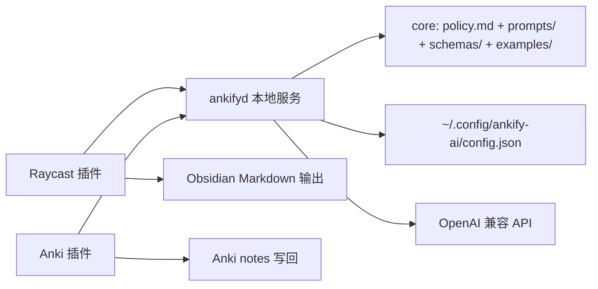

# Ankify AI 共享后端：可行性结论与总体架构

> 2025-09 更新：架构已从“两端各自 vendor core”演进为 **ankifyd 本地服务**。当前实现以服务版为准，详见 `ankifyd-plan.md`。

## 1. 结论：可行

Raycast 插件（TypeScript）与 Anki 插件（Python）**可以共享同一套后端**。最终选型：

> **共享 `ankifyd` 本地服务**：服务统一持有 core（policy + prompts + JSON Schema + examples）和 AI 配置，两端只做薄壳调用。

理由：

1. 两端都调用 OpenAI 兼容的 `chat/completions`，把调用收进本地服务后，配置与提示词只有一份。
2. 两端业务差异只在：输入源不同（图片/文本 vs Anki note）、输出落点不同（Markdown vs Anki collection）、调用封装不同（TS fetch vs Python HTTP）。这些属于薄适配层，不属于“后端”。
3. 卡片对象模型（front/back/type/tags/extra）在两个场景中是同一概念，可以共用 Schema 和示例。
4. 本地服务方式比各自 vendor core 更容易热更新提示词、统一限流与排查问题。

## 2. 核心边界：共享什么 / 不共享什么

| 共享（ankifyd 服务拥有） | 不共享（各自实现） |
|---|---|
| core：卡片分类法 A1-B8、制作 criteria、few-shot 示例 | 图片 OCR/多模态读取（Raycast） |
| classify / ankify / audit 的 prompt 组装与模型调用 | Anki note 抽取与写回（Anki 插件） |
| JSON Schema 校验与 tool-call 解析 | Markdown 渲染（Raycast） |
| OpenAI 兼容 API 配置（endpoint / api_key / models） | Anki 批量预览 UI（Anki 插件） |
| 重试/超时策略 | 各自的文件选择、剪贴板读取等 UI 逻辑 |

## 3. 总体架构



## 4. 共享核心目录（建议）

```text
ankify-ai-core/
  VERSION
  policy.md                  # 分类法 + criteria + 例子（即 temp 的清洗版）
  prompts/
    system-core.md           # 两端共用的系统提示词主体
    task-classify.md         # 分类任务（Raycast 一段 / Anki 二段可选）
    task-ankify.md           # 文本 -> 卡片（Raycast 专用任务头）
    task-audit.md            # note -> modify/split/keep（Anki 专用任务头）
  schemas/
    card.json                # 单张卡片对象
    classify_result.json     # 分类结果
    ankify_result.json       # 文本转卡片结果（含 markdown 说明）
    audit_tools.json         # Anki 审计工具定义
  examples/
    classify_examples.json
    ankify_examples.json
    audit_examples.json
```

单一事实源：`ankify-ai-core` 只维护一份。两个插件在构建/安装时把该目录 vendor 进自己的资源目录，**禁止手改自己目录里的副本**。

## 5. 两端的共同契约

### 5.1 卡片对象（core 统一）

```json
{
  "front": "一句话问题或填空",
  "back": "最短答案",
  "type": "A1|A2|A3|A4|B1|B2|B3|B4|B5|B6|B7|B8",
  "tags": ["exam:history"],
  "extra": "可选的背景/助记/来源，复习后阅读，不作考点"
}
```

### 5.2 Raycast 输出

- 分类结果：`{ "types": ["A4", "B3"], "complexity": "atomic|structural", "pipeline": "single|two-pass" }`
- 卡片结果：`{ "cards": [card...], "markdown": "由 Raycast 按约定模板渲染" }`

### 5.3 Anki 插件审计输出（tool calls）

- `modify_note(note_guid, fields, reason, type_hint, reset_scheduling)`
- `split_note(note_guid, new_notes[], reason)`
- 合适则**不调用任何工具**，即 keep。

## 6. 主要风险与对策

| 风险 | 对策 |
|---|---|
| 两端 prompt 各自漂移 | core 版本号 + 构建脚本校验 VERSION；核心提示词不可本地改 |
| Schema 演进破坏对端 | Schema 用 JSON Schema 做 CI 校验；只做向后兼容变更 |
| LLM 审计错误率高 | 先单轮；错误率高时切 two-pass（先分类，再按类型给专门指令） |
| 隐私：note 内容离开设备 | 插件默认 dry-run；设置页明示 API 上传；敏感 deck 可排除 |
| 成本/限流 | Anki 端分批 10-20 note/请求；失败指数退避重试 |

## 7. 文档索引

- ankifyd 本地服务计划与协议：`ankifyd-plan.md`
- 完整 Anki 插件计划：`anki-plugin-plan.md`
- 给 Raycast 插件团队的对接说明：`raycast-shared-backend-report.md`
