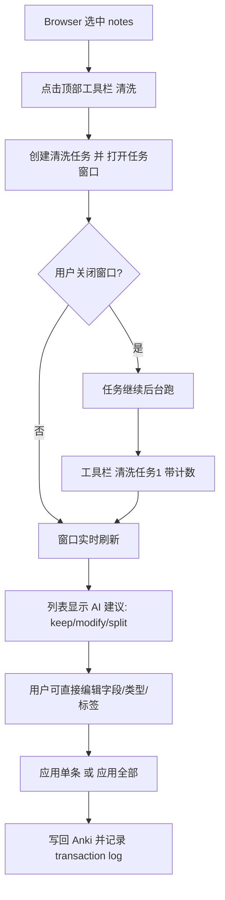

# Anki 插件构建规格：Ankify AI Auditor

> 状态：实现规格（Architect 模式产物，不含业务代码）。
> 编码时可逐节翻译为 Python。

## 1. 目标与成功标准

在 Anki Browser 中，对选中笔记执行“清洗”：调用共享 core 提示的 AI，对每条 note 给出 keep / modify / split 动作；用户可在任务界面动态审阅、编辑、应用结果。

成功标准：
1. Browser 选中若干 notes → 顶部工具栏点“清洗” → 出现可关闭的任务窗口，任务继续后台运行。
2. 工具栏插件入口出现“清洗任务 1”，带进度与计数；可随时打开。
3. 任务窗口像 Anki 内置列表一样可编辑：新卡片/修改笔记的字段、类型、标签可改。
4. 窗口显示：已跑 X / 共 Y 张笔记；创建 Z 张笔记 / Z2 张卡片；修改 W 张笔记；失败 F 张。
5. 应用动作后符合本计划的学习数据策略（modify 保留调度；split 新建 + 原 note suspend 并打标签）。
6. 全程可回滚（transaction log）。

## 2. UX 流程



细节：
- “清洗”按钮在 Browser 顶部工具栏；若 Anki 版本/平台不暴露工具栏插入点，则退化为 Browser 的 Tools 菜单项，并在设置里说明。
- 点击“清洗”后：
  1. 读取当前 Browser 选中的 note ids（不是 card ids）。
  2. 过滤已加锁 note（`ankify-ai::locked`）。
  3. 创建任务对象，状态为 running。
  4. 打开任务窗口（modeless，可关闭）。
- 工具栏“清洗任务 1”是插件注入的 QAction，标题随任务编号递增；显示活跃任务数和待处理动作数。

## 3. 文件布局（建议）

```text
addons21/ankify-ai-auditor/
  __init__.py            # 入口：注册 Browser hook、工具栏 action、配置
  config.py              # 配置读写
  core_loader.py         # 加载 vendor 的 ankify-ai-core，校验 VERSION
  note_repo.py           # 选中 notes 抽取、按 guid 写回、新建、suspend
  prompt_builder.py      # 组装 system/user/tools
  api_client.py          # DeepSeek / OpenAI 兼容调用，指数退避
  validator.py           # 校验工具调用与字段
  applier.py             # 应用 modify/split；写 transaction log
  task_manager.py        # 后台任务、批次、进度、结果队列
  ui/
    dialog.py            # 初始清洗确认/设置对话框
    task_panel.py        # 任务窗口主体
    edit_table.py        # 可编辑列表（QTableView + model）
  transaction_log.py     # 回滚日志
  resources/
    ankify-ai-core/      # 从仓库 vendor 过来的共享 core
  manifest.json / meta.json（按 Anki 插件规范）
```

## 4. 核心数据结构（JSON 契约）

### 4.1 NotePayload（抽取输出）

```json
{
  "guid": "f47ac10b-...",
  "id": 1712345678901,
  "model": "Basic",
  "fields": { "Front": "...", "Back": "..." },
  "tags": ["history"],
  "decks": ["History::1848"],
  "card_templates": ["Card 1"],
  "review": { "card_count": 1, "max_interval": 21, "avg_ease": 2.1, "lapses": 6, "reps": 12, "leech": true }
}
```

### 4.2 AuditAction（AI 返回并校验后）

```json
{
  "note_guid": "...",
  "action": "modify | split | keep",
  "fields": { "Front": "...", "Back": "..." },
  "type_hint": "A4",
  "tags": ["history"],
  "reason": "...",
  "reset_scheduling": false,
  "new_notes": [
    { "fields": { "Front": "...", "Back": "..." }, "type_hint": "A4", "tags": ["history"] }
  ]
}
```

### 4.3 TaskStats

```json
{
  "total": 50,
  "processed": 31,
  "keep": 20,
  "modify": 6,
  "split": 5,
  "created_notes": 18,
  "created_cards": 18,
  "modified_notes": 6,
  "failed": 0,
  "pending_actions": 11
}
```

## 5. 模块职责

| 模块 | 职责 | 关键输入/输出 |
|---|---|---|
| `__init__` | 注册 `browser.setupMenus` 或等效 hook；添加“清洗” action；维护任务编号；添加“清洗任务 N” action | Browser 对象 |
| `config` | endpoint、api_key、model、batch_size、dry_run、two_pass、reset_on_key_change、source_tag、locked_tag、exclude_decks | Anki addon config |
| `core_loader` | 定位 `resources/ankify-ai-core`，读 VERSION，读 policy/prompts/schemas/examples | 路径 + 文本 |
| `note_repo` | 从 `browser.selected_notes()` 取 notes；按 NotePayload 序列化；按 guid 查找 note；更新 fields；创建新 note；suspend 原 note 并打标签 | collection API |
| `prompt_builder` | system = system-core + policy + task-audit；user = 批次 NotePayload JSON；tools = audit_tools | 消息数组 |
| `api_client` | POST chat/completions；支持 tools 与 json_object；指数退避 3 次；超时 180s | 响应 |
| `validator` | 校验 tool_calls：guid 存在、字段名合法、type_hint 枚举、new_notes 非空且字段合法 | AuditAction 列表 |
| `applier` | 执行 modify（更新字段；可选 reset_scheduling）；执行 split（新建 notes；原 note suspend + 打标签）；写 transaction log | collection 写操作 |
| `task_manager` | 后台线程；分批 10-20；维护 TaskStats；把 AuditAction 推给 UI；支持取消 | 任务状态 |
| `ui.task_panel` | 任务窗口；进度条；统计标签；“应用全部”按钮 | 用户交互 |
| `ui.edit_table` | QTableView 展示新/改 notes；单元格可编辑 Front/Back/type/tags；行级“应用” | 用户交互 |
| `transaction_log` | 写 JSON 日志到 `addons21/ankify-ai-auditor/logs/`；保存 modify 前字段与 split 原 note 信息 | 回滚依据 |

## 6. 动作语义（与计划一致）

| 动作 | 写回 | 学习数据 |
|---|---|---|
| keep | 无 | 不动 |
| modify | 更新原 note 字段，保留 model/tags/deck | 默认保留调度；`reset_scheduling=true` 时用 Anki 调度 API 将受影响 card 重置为新卡 |
| split | 新建 N 条 note；原 note 打 `ankify-ai::split-source` 并 suspend | 新 card 从新卡开始；原 card 随 suspend 停止出现 |

## 7. 任务窗口 UI 规格

- 顶部：任务标题“清洗任务 1”、状态（running / done / cancelled / error）。
- 统计行：`已跑 31/50 · 修改 6 · 拆解 5 · 新建笔记 18 · 新建卡片 18 · 失败 0`。
- 中部：表格，列：`状态 / 原 Front / 原 Back / 新 Front / 新 Back / 类型 / 标签 / 理由 / 操作`。
  - keep 行灰显。
  - modify 行显示原值与新值，新值单元格可编辑。
  - split 行展开为多个子行（每个新 note 一行），可编辑。
- 底部：`应用全部`、`应用选中`、`关闭（后台继续）`。
- 所有 AI 建议在应用前都不落库；关闭窗口后后台继续跑，完成后工具栏入口保持可用并显示摘要。

## 8. 后台任务与线程

- 使用 Python `threading` + Qt 信号槽（或 Anki `taskman`）在后台执行 API 调用。
- 批次大小默认 10；每批完成后把 AuditAction 推入线程安全队列，UI 定时拉取刷新。
- 支持取消：已发出的请求不可中断，但剩余批次不再发送；任务状态置为 cancelled。
- 失败重试：单批失败重试 3 次（指数退避），仍失败则该批全部标 failed，不阻塞后续批次。

## 9. 配置项

| 键 | 默认值 | 说明 |
|---|---|---|
| `api_endpoint` | `https://api.deepseek.com/chat/completions` | 也兼容 OpenAI 风格端点 |
| `api_key` | 空，引导用户填 | 可复用 `DEEPSEEK_API_KEY` 环境变量，但不写入明文日志 |
| `model` | `deepseek-chat` | 需支持 tools / json_object |
| `batch_size` | 10 | 每批 note 数 |
| `dry_run` | false | true 时只生成建议不落库 |
| `two_pass` | false | 先分类再执行 |
| `reset_on_key_change` | true | modify 且 front 语义变化时重置调度 |
| `source_tag` | `ankify-ai::split-source` | split 原 note 标签 |
| `locked_tag` | `ankify-ai::locked` | 跳过保护 |
| `exclude_decks` | [] | deck 前缀黑名单 |

## 10. 验收测试

1. Browser 选 20 条混合 notes，点“清洗”，窗口出现，统计数与实际一致。
2. 关闭窗口，任务继续跑；工具栏“清洗任务 1”可见，重新打开窗口能看到进度。
3. 在表格中修改一条建议的 Front/Back 后“应用”，Anki 中对应 note 字段被更新，调度保留。
4. 对一条时间线 note 应用 split，原 note suspend + 打标签，新 notes 可正常复习。
5. transaction log 文件存在，可手工恢复 modify 前字段。
6. 断网或 API 失败时，任务不崩溃，failed 计数正确，日志可读。

## 11. 与共享 core 的关系

- 插件安装时复制仓库 `ankify-ai-core/` 到 `resources/ankify-ai-core/`。
- 启动时校验 VERSION；不匹配则提示升级。
- 插件不得修改 resources 内的 core 文件。
