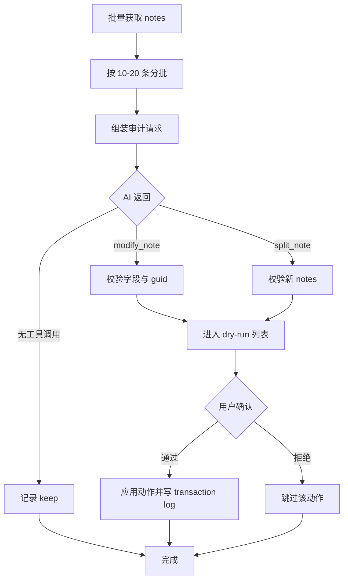

# Anki 插件计划：Ankify AI Auditor（note 维度）

## 0. 前提修正与标识符

- 操作对象是 **note（笔记）**，不是 card。
- Anki note 有两个标识：
  - `id`：collection 内唯一整数，内部定位用。
  - `guid`：创建时生成的 UUID-like 文本，导入去重也依赖它，比 `id` 更接近“稳定唯一标识”。
- **契约约定**：AI 侧一律使用 `guid` 作为 note 的外部唯一标识；插件内部维护 `guid -> id` 映射。

## 1. 目标与成功标准

### 目标
把用户选中的现有 notes 批量抽取为轻量 JSON，交给共享 core 提示的 AI，由 AI 决定每张 note：**保持 / 修改 / 拆解**，经用户预览确认后写回 Anki。

### 成功标准
1. 选中 50 条 notes，插件能分批处理并在 1-2 分钟内给出全部建议。
2. 所有 AI 输出经过 Schema 校验；非法动作不会进入写回阶段。
3. 默认 dry-run：用户确认前不修改任何 note。
4. `modify` 默认保留调度；`split` 原 note 只 suspend 不删除，且带 `ankify-ai::split-source` 标签。
5. 每次写回都有 transaction log，可人工恢复 modify 前的字段。

## 2. 非目标（Out of Scope）

- 不从图片/文本生成新卡（Raycast 职责）。
- 不修改 Anki 调度算法，仅可能调用 Anki 现有 API 重置调度。
- 不自动删除 note。
- 不实现多用户/多设备同步（本地插件）。

## 3. 总体架构


## 4. 共享 core 接入

- 安装时把 `ankify-ai-core/` vendor 到插件资源目录。
- `core_loader` 启动时校验 `VERSION` 与插件 manifest 声明的兼容版本。
- 运行时只读加载：
  - `policy.md` 作为 system prompt 主体。
  - `prompts/task-audit.md` 作为审计任务头。
  - `schemas/card.json` 和 `schemas/audit_tools.json` 用于构建工具定义和校验。
- 插件不修改 core 文件；core 升级走独立更新流程。

## 5. Note 抽取契约

每条 note 序列化为：

```json
{
  "guid": "f47ac10b-...",
  "id": 1712345678901,
  "model": "Basic",
  "fields": {
    "Front": "1848 二月革命从 2.22 到 2.25 发生了什么？",
    "Back": "2.22 示威，2.23 基佐辞职、卡普辛大道枪击，2.24 路易·菲利普退位，2.25 第二共和国成立"
  },
  "tags": ["history"],
  "decks": ["History::1848"],
  "card_templates": ["Card 1"],
  "review": {
    "card_count": 1,
    "max_interval": 21,
    "avg_ease": 2.1,
    "lapses": 6,
    "reps": 12,
    "leech": true
  }
}
```

字段说明：
- `fields` 只包含该 note type 的实际字段名，保持原样。
- `review` 是聚合值：`lapses` 和 `leech` 是审计重点（对应“Tractable / 定期清理”）。
- `decks` 是 note 各 card 所在 deck 的去重列表。

## 6. AI 调用契约

### 6.1 单轮模式（默认）

一次请求携带：
- system：`system-core.md` + `task-audit.md`。
- user：一批 notes 的 JSON 数组。
- tools：`audit_tools.json`。

AI 可返回：
1. 不调用工具：keep（合适）。
2. `modify_note`：不合适但只需改字段。
3. `split_note`：不合适且需要拆成多条 note。

### 6.2 工具定义

`modify_note`：
- `note_guid`：目标 note。
- `fields`：替换后的字段字典（未提及字段保持不变）。
- `reason`：一句中文/英文修改理由。
- `type_hint`：修正后的卡片类型 A1-B8。
- `reset_scheduling`：bool，默认 false。

`split_note`：
- `note_guid`：目标 note。
- `new_notes`：新 note 数组，每项含 `fields`、`type_hint`、`tags`（可选）。
- `reason`：拆解理由。

### 6.3 两轮模式（可选，错误率高时启用）

1. 第一轮：只让 AI 输出每条 note 的 `card_type` 与 `action`（modify/split/keep）和 `reason`。
2. 第二轮：按类型分组，把 `task-audit.md` 换成带该类型专门指令的提示，并附上第一轮标注，让 AI 输出具体 `fields` / `new_notes`。
3. 两轮共用同一 `policy.md` 和 Schema。

## 7. 动作语义与学习数据策略

| 动作 | 写回方式 | 学习数据 |
|---|---|---|
| keep | 无写回 | 不动 |
| modify | 更新原 note 的字段；保留 model、tags、deck | 默认保留 card 调度；若 `reset_scheduling=true`（front 的 key 语义已变），用 Anki 调度 API 将受影响 card 重置为新卡 |
| split | 新建 N 条 note；原 note 打 `ankify-ai::split-source` 标签并 suspend | 新 note 生成的新 card 从新卡开始；原 note 的 card 随 suspend 停止出现 |

设计理由：
- `modify` 大多是措辞优化，旧记忆仍有迁移价值，保留调度可省复习成本。
- 只有 front 的“检索键”发生语义改变时才重置，避免用旧记忆去答新题。
- `split` 的原 note 不删除：可回滚、可追溯、可避免误删；用户确认无误后可手动删除。

## 8. 模块划分（Python add-on）

| 模块 | 职责 |
|---|---|
| `config.py` | 配置读写、API key、模型、批次大小、dry-run 默认值 |
| `core_loader.py` | 加载 vendor 的 shared core，校验版本 |
| `note_repo.py` | 从 Anki collection 抽取 note JSON；按 guid 写回/新建/suspend |
| `prompt_builder.py` | 组装 system/user/tools；两轮模式的分组与标注 |
| `api_client.py` | 调用 OpenAI 兼容接口；指数退避重试；超时控制 |
| `validator.py` | 校验工具调用合法性（guid 存在、字段名匹配、JSON Schema） |
| `action_applier.py` | 执行 modify/split；调用 Anki 调度重置；维护 transaction log |
| `dialog.py` | dry-run 预览对话框，逐条批准/拒绝 |
| `transaction_log.py` | 写 JSON 日志到 addons 目录，保存 modify 前字段 |
| `logger.py` | 运行日志 |

## 9. 处理决策树



## 10. 错误处理

| 错误 | 处理 |
|---|---|
| guid 不存在 | 跳过并记日志；不中断整批 |
| 新字段名与 note type 不匹配 | 校验失败，该动作进入“需人工处理”列表 |
| AI 返回非法 JSON / Schema 不符 | 该批重试一次；仍失败则降级为只报告不执行 |
| API 限流 / 5xx | 指数退避重试 3 次；仍失败则保存现场，下次续跑 |
| 空字段 / 空 new_notes | 拒绝该动作 |
| 受保护 note（tag 含 `ankify-ai::locked`） | 跳过 |

## 11. 配置项

| 配置 | 默认值 | 说明 |
|---|---|---|
| `api_endpoint` | 用户填 | OpenAI 兼容端点 |
| `api_key` | 用户填 | 存 Anki 配置，不明文写日志 |
| `model` | 用户填 | 支持 function calling 的模型 |
| `batch_size` | 10 | 每批 note 数 |
| `dry_run_default` | true | 首次运行先看预览 |
| `two_pass` | false | 错误率高时开启 |
| `reset_on_key_change` | true | modify 时若 front 改变，默认重置调度 |
| `source_tag` | `ankify-ai::split-source` | split 原 note 的标签 |
| `locked_tag` | `ankify-ai::locked` | 跳过保护 |
| `exclude_decks` | 空 | 排除 deck 前缀列表 |

## 12. 测试计划

1. 单元：`prompt_builder` 对 core 文件缺失/版本不匹配报错。
2. 单元：`validator` 对 guid 缺失、字段不匹配、空 new_notes 全部拦截。
3. 集成：在副本 collection 上跑 20 条混合 notes，确认 keep/modify/split 比例合理，dry-run 不落库。
4. 回滚：模拟 modify 后从 transaction log 恢复原字段。
5. 端到端：真实 deck 先 dry-run，再小批实写，检查原 note suspend、新 note 生成、调度保留/重置。

## 13. 交付步骤（建议顺序）

1. 把用户 temp 文件清洗为 `ankify-ai-core/policy.md`，并补 A1-B8 分类表。
2. 编写 `schemas/card.json`、`schemas/audit_tools.json` 与 `prompts/` 四个文件。
3. 用共享 core 做一次手工 prompt 验证（拿 1848 例子测 modify/split）。
4. 脚手架 Anki add-on，实现 note 抽取与 JSON 序列化。
5. 实现 API 调用 + 校验 + dry-run 对话框。
6. 实现写回与 transaction log。
7. 真实 deck 测试，调整 prompt 和 batch_size。
8. 写 `document/feature_intent/ankify-ai.md` 与插件 README。
9. 提交 commit。

## 14. 与 Raycast 的共享点（摘要）

- 共享 `policy.md`、`system-core.md`、`schemas/card.json`、`schemas/classify_result.json`。
- 不共享 `task-audit.md`（Anki 专用）与 `task-ankify.md`（Raycast 专用）。
- 两轮模式的“分类”阶段可复用同一个 `task-classify.md`。
